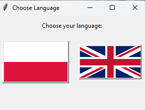
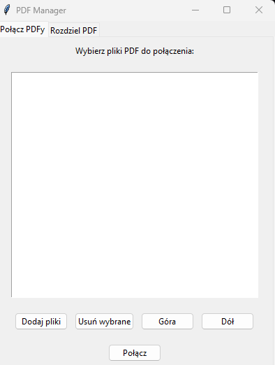
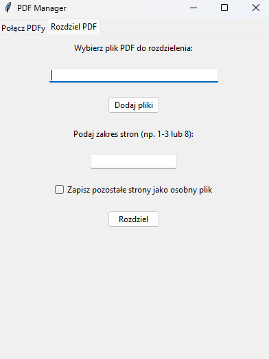

# 📄 PDFManager

**Prosty menedżer PDF do własnych potrzeb** – łączenie i rozdzielanie PDF w wygodnym GUI.

---

## 🚀 Funkcje

📌 Łączenie wielu plików PDF w jeden  
📌 Rozdzielanie plików PDF na wybrane strony  
📌 Możliwość zapisu pozostałych stron jako osobny plik  
📌 Intuicyjny interfejs z wyborem języka (🇵🇱/🇬🇧)  

---

## 🖼️ Zrzuty ekranu

| 🇵🇱 Wybór języka | ➕ Łączenie PDF | ✂️ Rozdzielanie PDF |
|---|---|---|
|  |  |  |

---

## 🛠️ Instrukcja użycia

### ⚡ Uruchomienie

```sh
python main.py
```
lub uruchom PDFManager.exe, jeśli korzystasz z wersji skompilowanej.

## 🗂️ Zakładki
### ➕ Połącz PDFy
📄 Dodaj pliki PDF, które chcesz połączyć
🗑️ Usuń wybrane pliki, jeśli popełnisz błąd
🔼🔽 Użyj przycisków Góra/Dół do zmiany kolejności
✅ Kliknij Połącz, aby stworzyć scalony PDF

### ✂️ Rozdziel PDF
📄 Wybierz plik PDF do rozdzielenia
🔢 Podaj zakres stron do wycięcia, np. 1-3 lub 8
💾 (Opcjonalnie) zaznacz opcję zapisu pozostałych stron jako osobny plik
✅ Kliknij Rozdziel, aby utworzyć nowy PDF

## 🌍 English Instructions
⚡ Run the Program
```sh
python main.py
```
or launch PDFManager.exe if using the compiled version.

## 🗂️ Tabs
### ➕ Merge PDFs
📄 Add PDF files you want to merge
🗑️ Remove files if needed
🔼🔽 Use Up/Down buttons to adjust order
✅ Click Merge to create a combined PDF

### ✂️ Split PDF
📄 Select the PDF file to split
🔢 Enter the page range to extract, e.g., 1-3 or 8
💾 (Optional) Check save remaining pages as a separate file
✅ Click Split to generate the new PDF

## 🏳️ Flags
Flags from: flagpedia.net

## ⚙️ Wymagania
Python 3.x

PyPDF2 (lub inne zależności z requirements.txt)

Instalacja zależności
```sh
pip install -r requirements.txt
```
